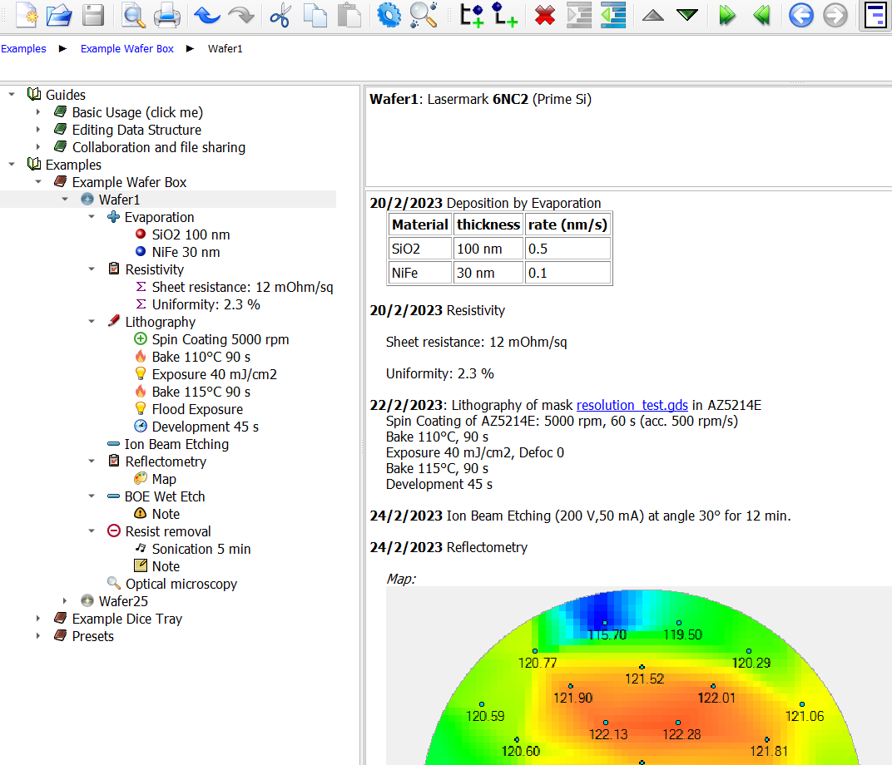

# Cleanrooom ELN
 A Template for https://github.com/doug-101/TreeLine
 
 This template for TreeLine helps you organize a process database with a specific eye to R&D in microfabrication and material science (but adaptable to any other area).
 It can be considered an alternative Electronic Lab Notebook (ELN) with the following advantages:
 
* Logical tree view of arbitrarily complex and detailed process flows.
* Easily adaptable to different cases of use.
* Completely file based, your data are always with you.
* A workflow completely based on open source, multi-platform software.
* No need for paying or hosting a web service.
	

## Usage

* Install https://treeline.bellz.org
* Download the files in this repository
* (Optional) add files from Extra Icons to the icons/tree folder of your Treeline install
* Open Guide.trln for help pages, basic templates and examples.
